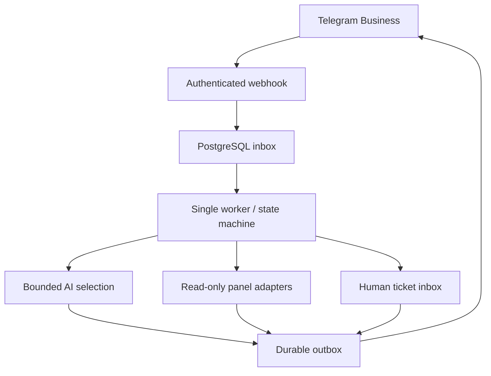

# Architecture Decision Record — V1.1

## Execution topology

The core is a **modular monolith**, not a swarm of untrusted autonomous agents.

1. HTTPS reverse proxy receives Telegram updates.
2. FastAPI authenticates the Telegram secret and writes each update once to PostgreSQL.
3. The single default worker claims an update, locks its conversation row, applies a deterministic state transition, and stores an output intent.
4. Outbox transport dispatches an approved message through the Business Bot API.
5. An operator can take over and stop further AI proposals.

### Data flow

## State and concurrency

Conversation identity: (business_connection_id, chat_id), with a database uniqueness constraint. Every transition increments revision. Inline menus store an unpredictable nonce, plus a server-side array of permitted actions. Callback actions are never trusted directly from user-supplied strings.

The event lease is a *recovery* mechanism, not a parallel per-chat work scheduler. **Run only one worker instance in V1**; scaling requires per-chat serial scheduling, lease renewal and fencing. PostgreSQL SKIP LOCKED avoids simultaneous row claims but does not by itself guarantee ordered execution of two queued updates for the same conversation with multiple workers.

A Telegram send outcome may be unknown after an HTTP timeout or process crash. A prior in-flight send becomes **uncertain**; it must be inspected and resolved manually. This chooses at-most-one automatic attempt over blind retries, not mathematically guaranteed exactly-once delivery. Confirmed edits can be retried safely only when semantics are proven idempotent.

## Ownership and human handoff

Modes: ai, human_pending, human. Customer messages are always recorded; only ai mode can invoke the AI workflow. Human pending is created by explicit request, failed authorized lookup, or unresolved knowledge, with an open ticket. Owner-origin Business messages set human immediately. Admin resume clears the previous workflow and increments the revision.

Active business playbooks are stored as versioned, validated YAML. Superseded conversation workflows reset safely instead of continuing under an incompatible schema. A pre-send revision check cancels stale outbox work. A race still exists if a human types *after* the check and *while* a network send is in-flight. Full distributed atomic send coordination is impossible across Telegram and PostgreSQL. Production governance should monitor this and maintain an operator emergency pause.

## Security boundaries

Untrusted: inbound Telegram text, URLs, callback payloads, images, file names, model output. Trusted only after validation: Webhook secret, admin authentication, local config, business rights, authenticated internal provisioning API and panel data with a known shape.

The model selects only predefined menu actions or options. It cannot execute SQL, call arbitrary HTTP URLs, access panel tokens or declare a receipt paid. Links are fingerprinted with an environment-bound HMAC pepper. Unknown links lead to human support.

## Explicit V1 limitations

- No automatic payment confirmation, renewals, provisioning or subscription mutation.
- No retroactive customer history before bot connection.
- No multi-worker horizontal processing guarantee.
- No per-account business settings within one deployment.
- No vector embedding index or autonomous financial image validation. Optional vision extracts bounded technical clues from troubleshooting screenshots; financial evidence remains in the human-review path.
- Database schema is initialized by Alembic migration 0001 on first boot. All future schema changes require reviewed forward migrations, backups and a staging rehearsal.

## V1.1 support-hardening additions

- Monitor-only startup and audited admin automation switch.
- Real human reply outbox, operator message capture, follow-up evidence alerts, safe menu handoff edits.
- Optional bounded screenshot and voice analysis; financial documents excluded from model vision.
- Subscription catalog backfill and URL-token fingerprints for trusted relay-domain links.
- Durable worker heartbeat and readiness endpoint; explicit human-feedback outcome metrics.
- Rule-based slot extraction prevents redundant device/application questions.

The LLM remains a bounded classifier and approved-FAQ selector; it is **not** given arbitrary terminal, database or network tools. A privacy-controlled learning pipeline and end-to-end production integrations need additional review before full autonomy.

## Support operations (V1.1)

Every escalation creates a ticket with a configurable first-response SLA (default 60 minutes), priority, category and optional assignment. A single worker escalates unanswered tickets once, records an audit event and can notify the operator chat. Internal notes are never delivered to customers. Ticket closure does not automatically reactivate AI; an operator must explicitly resume it.

## V1.1 operational safeguards

Human messages are intentional sends: multiple queued operator messages preserve FIFO order, and an earlier ambiguous send blocks following sends until explicit reconciliation. A ticket's first-response SLA is satisfied **only after confirmed Telegram delivery** or an observed manual owner reply, not on enqueue. SLA sweeps run periodically even during a busy inbox.

The inbox can combine adjacent short text-only messages from the same customer into a single model interaction, while retaining each constituent message for auditing. Media, owner-authored messages, and intervening other chat events break the batch. A single worker is still required until per-chat distributed fencing is implemented and tested.

Human operators can generate review-only suggested replies. No automatic Telegram send occurs. Resolved tickets may produce unpublished FAQ candidates: separate operator approval is required before they can answer customer requests. The application supports bounded retention scrubbing and an authenticated, explicitly confirmed local erasure operation, but not removal of outside Telegram history or old backups.

## Readiness-branch changes

- PostgreSQL session advisory lock rejects a second worker. The inbox is globally ordered including retry backoff and unexpired leases. Late older customer message IDs are archived without changing a newer workflow. Throughput is deliberately limited by this topology.
- Delivery retains a conversation row lock through the bounded external request and finalization. Administrative ownership changes use the same lock. Telegram-side manual messages are only known once received/processed: no cross-system atomicity is claimed.
- SIGTERM/SIGINT stop new claims and drain the current iteration. If forced termination occurs mid-send, existing uncertainty recovery still applies.
- Migrations through `0010_operators` add delivery attempts, historical-import candidates and separate hashed staff identities.
- Insight is a separate offline preprocessing/review module. No model or archived image is sent externally by Insight. Approval copies a reviewed candidate into active knowledge; raw imports are not retained.
- The admin shell is server-rendered Jinja with shared CSS and a small theme/submit-feedback script, preserving the existing VPS-friendly deployment without a separate frontend service.

See [READINESS.md](READINESS.md) for phase coverage and residual risks; model-call counting is not a transaction-independent financial ledger.
